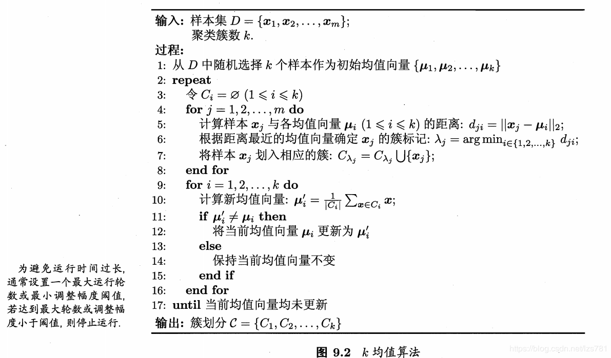

---
categories:
 - YOLO3 源码分析
tags:
 - YOLO3
 - Keras
toc: true
mathjax: true
---


YOLO3 Keras 源码：https://github.com/qqwweee/keras-yolo3

## 前言

本文从主要是从源码层面对 YOLO3 的数据处理相关内容进行分析与讲解。通常，一个功能的实现需要多个函数配合，所以我将每个功能的实现函数分为两部分，**基础函数** 和 **实现函数** ：

+ 基础函数：被实现函数所依赖，是实现函数的一部分
+ 实现函数：通过调用基础函数实现功能

源码内容比较多，通过目录索引看感兴趣的地方即可。

## 数据处理

### 数据集转换

YOLO3 Keras 源码所需要的数据集应该在一个`.txt` ( 文本文件 )内，文件中的一行代表一个张图片和它的标签，其中每行的格式为：

```
image_file_path box1 box2 ... boxN
```

`box*` 是该图片的标签，即真实框，不同box之间用空格隔开，其中每个box的格式为

```
x_min,y_min,x_max,y_max,class_id
```

所以总的来说，训练用的数据集应该大体是这个样子的：

<!-- more -->

```
path/to/img1.jpg 50,100,150,200,0 30,50,200,120,3
path/to/img2.jpg 120,300,250,600,2
...
```

对于 VOC 数据集，Keras 源码的作者给出了脚本 `voc_annotation.py` 可以将 VOC 数据集转化成上述格式。

### 源码分析

```python
import xml.etree.ElementTree as ET
from os import getcwd

sets=[('2007', 'train'), ('2007', 'val'), ('2007', 'test')]

classes = ["aeroplane", "bicycle", "bird", "boat", "bottle", "bus", "car", "cat", "chair", "cow", "diningtable", "dog", "horse", "motorbike", "person", "pottedplant", "sheep", "sofa", "train", "tvmonitor"]


def convert_annotation(year, image_id, list_file):
    in_file = open('VOCdevkit/VOC%s/Annotations/%s.xml'%(year, image_id))
    tree=ET.parse(in_file)
    root = tree.getroot()

    for obj in root.iter('object'):
        difficult = obj.find('difficult').text
        cls = obj.find('name').text
        if cls not in classes or int(difficult)==1:
            continue
        cls_id = classes.index(cls)
        xmlbox = obj.find('bndbox')
        b = (int(xmlbox.find('xmin').text), int(xmlbox.find('ymin').text), int(xmlbox.find('xmax').text), int(xmlbox.find('ymax').text))
        list_file.write(" " + ",".join([str(a) for a in b]) + ',' + str(cls_id))

wd = getcwd()

for year, image_set in sets:
    image_ids = open('VOCdevkit/VOC%s/ImageSets/Main/%s.txt'%(year, image_set)).read().strip().split()
    list_file = open('%s_%s.txt'%(year, image_set), 'w')
    for image_id in image_ids:
        list_file.write('%s/VOCdevkit/VOC%s/JPEGImages/%s.jpg'%(wd, year, image_id))
        convert_annotation(year, image_id, list_file)
        list_file.write('\n')
    list_file.close()
```

#### 基础函数：

##### `convert_annotation(year, image_id, list_file)`

参数：

+ **year**：整型，年代 , VOC2007 的 2007 
+ **image_id** ：图像序号
+ **list_file** ： 文件对象

功能：

+ 通过 `year` 和 `image_id`找到 VOC 数据集里的 xml 文件，通过 ElementTree 找到这个 XML 里的每一个 `object` 标签，获取该标签内的 `xmin,ymin,xmax,ymax`，和列表序号`class_id` ，把它们写入到 list_file 所打开的文件对象中。
+ 总之，这个函数是在将 `.xml` 中的标注信息转化为 YOLO3 所需要标注格式，并写入文件。

#### 实现过程

##### 脚本主内容

```python
for year, image_set in sets:
    image_ids = open('VOCdevkit/VOC%s/ImageSets/Main/%s.txt'%(year, image_set)).read().strip().split()
    list_file = open('%s_%s.txt'%(year, image_set), 'w')
    for image_id in image_ids:
        list_file.write('%s/VOCdevkit/VOC%s/JPEGImages/%s.jpg'%(wd, year, image_id))
        convert_annotation(year, image_id, list_file)
        list_file.write('\n')
    list_file.close()
```

`year, image_set` 是从 `sets` 提取而来，这个 for 循环的目的是操作 `sets` 中对应的每一个文件。

即打开`train.txt` 、`val.txt` 、`test.txt` ，它们里面内容长这个样：

```
0
1
10
100
1000
....
```

这其中每一行都是图片的序号。

如打开`train.txt` ，脚本通过 `.read().strip().split()` ，把 `train.txt` 中一行一行的图片序号变成一个列表 `image_ids` ，创建一个文件对象 `list_file` 随后对列表内每一个元素进行操作：

+ 根据文件路径和图片序号的映射关系，把图片路劲写入到 `list_file`  文件对象对应的文件中。
+ 通过 `convert_annotation` 把图片的标注信息（已转化为 YOLO3 所需格式），紧接着路径信息写在后面
+ 写入换行符

所以元素操作完事，关闭文件对象。

通过上述流程对 `train.txt` 、`val.txt` 、`test.txt` 都操作完，就把 VOC 数据集转化为 YOLO3 所需要的格式了。

### 使用 K-means 生成锚框

YOLO2 开始，锚框的生成使用 K-means 算法，这种倚靠训练数据自动生成的锚框，比人为设定的锚框更加符合特定场景的业务需求，所以会提高模型的准确度。

介绍 K-means 之前，需要先了解它是用于什么学习任务的，K-means 是解决聚类问题的一个算法。

#### 理论基础

**聚类和簇**

聚类任务是一种无监督学习任务，聚类试图将样本划分为若干个不相交的子集，每个子集成为**簇**，通过这样的划分，每个簇对应一个潜在类别，具体是什么类别，对于聚类算法而言是未知，都是在聚类结束后，人为的判断一个簇对应的什么类别。聚类常用于寻找数据内部的分布结构，或用于对其他分类学习任务进行粗略的预先处理。比如自从 YOLO2 后，聚类算法就被用于预先为图像划定锚框。

**距离计算**

聚类任务说到底是让”簇内相似度高“且”簇间相似度低“，那么就需要一个衡量相似度的指标，两个样本间的距离可以反映样本之间的相似度，所以定义 $dist(\cdot,\cdot)$ 为两个样本的距离。距离的计算有诸多算法，比如“闵可夫斯基距离”
$$
dist_{mk}(x_i,x_j)=(\sum_{u=1}^n|x_{i,u}-x_{j,x}|^p)^{\frac{1}{p}}
$$
在 YOLO2 和 YOLO3 中，距离计算是借助两个 box 的 IOU：
$$
dist(b_i,b_j)=1-IOU(b_i,b_j)
$$
**K-means 算法**

K-means 的思想是，对所划分的所有簇 $C=\{C_1,C_2,\dots,C_k\}$ 使
$$
E=\sum_{i=1}^k\sum_{x\in C_i}dist(x,\mu_i)
$$
最小，其中 $\mu_i=\frac{1}{|C_i|}\sum_{x\in C_i}x$ ，即 $\mu_i$ 是 $C_i$ 的均指向量。

为了达到这个目的，K-means 采用贪心策略，最开始随机指定 K 个向量作为 $(\mu_1,\dots,\mu_k)$ 对于每一个 $\mu_i$ ，计算每一个向量 $x$ 与 $\mu_i$ 的距离，即 $dist(x,\mu_i)$ 将距离值最小的向量，归到 $C_i$ 然后更新  $\mu_i$ ，重复这个过程，直到 $(\mu_1,\dots,\mu_k)$ 都不再更新。



#### 基础函数
##### `YOLO_Kmeans.__init__`

`YOLO_Kmeans` 是一个类，它的初始化函数如下：

```python
def __init__(self, cluster_number, filename):
    self.cluster_number = cluster_number
    self.filename = filename
```

其作用仅是将参数保留到类内

##### `YOLO_Kmeans.txt2boxes`

```python
def txt2boxes(self):
    f = open(self.filename, 'r')
    dataSet = []
    for line in f:
        infos = line.split(" ")
        length = len(infos)
        for i in range(1, length):
            width = int(infos[i].split(",")[2]) - \
                int(infos[i].split(",")[0])
            height = int(infos[i].split(",")[3]) - \
                int(infos[i].split(",")[1])
            dataSet.append([width, height])
    result = np.array(dataSet)
    f.close()
    return result
```

该方法的作用是将 YOLO 标注文件内的 box 信息转化为列表

YOLO 标注文件格式如下：

```
path/to/img1.jpg 50,100,150,200,0 30,50,200,120,3
path/to/img2.jpg 120,300,250,600,2
...
```

`f` 是一个文件对象，文件对象可迭代，每次读取文件的一行，最外层的 for 是指对文件内的每一行操作。

对文件内的每一行，以空格为分隔符，将其划分为列表 `infos` ：

对 `infos[1]` 到 `infors[length-1]` 中的每一个元素 `infos[i]` 而言，每一个 `infos[i]` 代表一组 box 信息。`infos[i].split(",")[0]` 、`infos[i].split(",")[1]` 、`infos[i].split(",")[2]` 、`infos[i].split(",")[3]`   、`infos[i].split(",")[4]`分别对应 box 信息里的 `x_min,y_min,x_max,y_max,class_id` ，由这些信息就可以计算出 box 的宽和高，记为`[width, height]` ，将每组 box 的 `[width, height]` 追加到 `dataSet` 列表内，将 `dataSet`  转化为 `np.array` 并返回。

##### `YOLO_Kmeans.iou`

```python
def iou(self, boxes, clusters):  # 1 box -> k clusters
    n = boxes.shape[0]
    k = self.cluster_number

    box_area = boxes[:, 0] * boxes[:, 1]
    box_area = box_area.repeat(k)
    box_area = np.reshape(box_area, (n, k))

    cluster_area = clusters[:, 0] * clusters[:, 1]
    cluster_area = np.tile(cluster_area, [1, n])
    cluster_area = np.reshape(cluster_area, (n, k))

    box_w_matrix = np.reshape(boxes[:, 0].repeat(k), (n, k))
    cluster_w_matrix = np.reshape(np.tile(clusters[:, 0], (1, n)), (n, k))
    min_w_matrix = np.minimum(cluster_w_matrix, box_w_matrix)

    box_h_matrix = np.reshape(boxes[:, 1].repeat(k), (n, k))
    cluster_h_matrix = np.reshape(np.tile(clusters[:, 1], (1, n)), (n, k))
    min_h_matrix = np.minimum(cluster_h_matrix, box_h_matrix)
    inter_area = np.multiply(min_w_matrix, min_h_matrix)

    result = inter_area / (box_area + cluster_area - inter_area)
    return result
```

参数：

+ boxes ： 盒子信息，结构为`[[w1,h1],[w2,h2]...]`
+ clusters：簇点信息，内含 k 个 `[w,h]` 结构为 `[[w1,h1],...,[wk,hk]]`

执行过程：

+ 求每个盒子的面积，重复 k 次，得到 n\*k 矩阵 `box_area` , n 是总盒子数，k 是簇数
+ 求每个簇点的面积，所有簇点面积集合记为 `cluster_area` , 一开始，`cluster_area` 是 `shape=(1,k)` 的 np 数组，经过 `np.tile` 变成 `shape=(1,k*n)`，`np.reshape` 成 `shape=(n,k)`
+ 用相似的维度变化，求盒子的 w 矩阵 `box_w_matrix`，与簇点的 w 矩阵 `cluster_w_matrix` ，用 `np.minimum` 取宽最小矩阵 `min_w_matrix`
+ 同理求高最小矩阵 `min_h_matrix`
+ 盒子与簇在假设左上角对齐的情况下，最小的宽\*最小的高就是他们相交的区域的面积，相交面积 `inter_area = np.multiply(min_w_matrix, min_h_matrix)`
+ 最终返回 IOU 值 IOU = 相交面积/相并面积 = 相交面积/( 盒子面积 + 簇点面积 - 相交面积 )，最红返回的 result 的形状 `shape=(n,k)`


##### `YOLO_Kmeans.kmeans`

```python
def kmeans(self, boxes, k, dist=np.median):
    box_number = boxes.shape[0]
    distances = np.empty((box_number, k))
    last_nearest = np.zeros((box_number,))
    np.random.seed()
    clusters = boxes[np.random.choice(
        box_number, k, replace=False)]  # init k clusters
    while True:

        distances = 1 - self.iou(boxes, clusters)

        current_nearest = np.argmin(distances, axis=1)
        if (last_nearest == current_nearest).all():
            break  # clusters won't change
        for cluster in range(k):
            clusters[cluster] = dist(  # update clusters
                boxes[current_nearest == cluster], axis=0)

        last_nearest = current_nearest

    return clusters
```

参数 :

+ boxes : 前面通过 `txt2boxes` 处理后得到的 np 数组，结构为`[[w1,h1],[w2,h2]...]`
+ k : 整型，簇数
+ dist : 均值向量生成策略，这里用的中位数（那应该叫中位数向量hhhh）

执行过程：

+ 得到 `boxes` 中的盒子数 ` box_number`，用 ` np.empty` 创建一个 `shape=(box_number, k)` 的空 np 数组 `distances`，用储存 boxes 中的每个盒子和每个簇的距离；用 `np.zeros` 创建一个长度为 ` box_number` 的一维全零 np 数组，用于存储每个盒子距离最近的簇的索引值。

+ 通过 `clusters = boxes[np.random.choice(box_number, k, replace=False)]` 从 `boxes`  中随机进行不放回抽样，选出 k 个 盒子信息作为初始的簇点。

    这里采用的是高级索引，`boxes[[1,2,3]]==[boxes[1],boxes[2],boxes[3]]` ，`numpy.random.choice(a, size=None, replace=True, p=None)` 它的参数从左到右依次表示候选列表、抽烟个数、是否放回、列表中各元素被抽中的概率。

+ 进行循环直到 break 才终止：

    + 计算boxes 中的每个盒子和每个簇的距离，结果存放入 `distances`， `self.iou(boxes, clusters)` 后面讲解。

    + 通过 `np.argmin(distances, axis=1)` 返回每个盒子距离最近的簇的索引值，结果存入`current_nearest`；`np.argmin(a, axis=None, out=None)` 可以沿 `axis`轴，在数组 `a` 中寻找最小值，并返回该值在 `axis` 轴内的索引。

    + 如果上一轮循环中每个盒子距离最近的簇的索引 `last_nearest` 和这一轮的 `current_nearest`  中每一个元素都相同，那么说明算法已经收敛，跳出循环。

        其中 `last_nearest == current_nearest` 由于双等号两边都是同型 np 数组，所以这个表达式返回的也是同型 np 数组，数组内元素类型是布尔型，表示对应元素是否相同，`np.np.array.all()` 表示若数组内元素都为 True 则返回 True，否则返回 False

    + 如果存在不同元素，就对 K 个簇点进行遍历， 让每个簇点等于该簇内向量的中位数。

        通过` boxes[current_nearest == cluster]` 找出所有"相对于其他簇点，与第`cluster` 个簇距离最近"的盒子，得到一个列表，列表结构为`[[w1,h1],[w2,h2]...]`

        通过 `dist` 即 `np.median` 对上述列表，沿第一个轴求中位数，最终得到结构为`[w,h]`的一维二元列表。

    + 更新结束，把当前状态 `current_nearest`  赋值给 `last_nearest ` 开始下一轮循环。

+ 循环结束，将簇点列表 `clusters` 返回，在 YOLO3 中，各簇点就是预设的锚框信息。


##### `YOLO_Kmeans.txt2clusters`

```python
def txt2clusters(self):
      = self.txt2boxes()
    result = self.kmeans(all_boxes, k=self.cluster_number)
    result = result[np.lexsort(result.T[0, None])]
    self.result2txt(result)
    print("K anchors:\n {}".format(result))
    print("Accuracy: {:.2f}%".format(
    self.avg_iou(all_boxes, result) * 100))
```

`txt2clusters` 是脚本的执行函数，求kmeans就是从这个函数入手，这个函数主要过程就是：

+ `txt2boxes` 将文本信息划分并提取成列表信息 `all_boxes` , `all_boxes` 内各个盒子的信息，结构为 `[[w1,h1],[w2,h2]...]`

+ 使用 `kmeans` 求盒子列表的聚类，返回的是 k 个簇点，结构也为 `[[w1,h1],[w2,h2]...]` j结果保存到 `result`

+ 通过 ` result[np.lexsort(result.T[0, None])]` 对 `result` 进行排序，排序规则是宽度小的在前面

    `result.T` 会对 `result` 转置，转置后结构为 `[[w1,...,wk],[h1...hk]]`

    `result.T[0,None]` 是只取宽度数据，并且扩充一维，变成`[[w1,...,wk]]`

    `lexsort(keys, axis=None)` ：返回一个整数数组（返回数组的元素是索引值）。`keys` 是一个序列的序列，要求内部序列形状相同，默认情况外部序列 `keys` 中的最后一个序列元素将作为主排序序列，倒数第二个序列元素作为第二排序序列....当主排序序列中元素大小相同时，就依照第二排序系列进行排序。

    `np.lexsort(result.T[0, None])` 输出结果是 `w1,...,wk` 依照升序排序后的顺序输出原索引值，是有 K 个元素的一维数组

+ 使用 `result2txt` 将结果输出为文本文件

+ 使用 `avg_iou` 评价聚类的结果

##### `YOLO_Kmeans.result2txt`

```python
def result2txt(self, data):
    f = open("yolo_anchors.txt", 'w')
    row = np.shape(data)[0]
    for i in range(row):
        if i == 0:
            x_y = "%d,%d" % (data[i][0], data[i][1])
        else:
            x_y = ", %d,%d" % (data[i][0], data[i][1])
        f.write(x_y)
    f.close()
```

将每一个簇点信息，写入 `yolo_anchors.txt` 文件，文件格式是：

```
w1,h1 w2,h2 ... wk,hk
```

##### `YOLO_Kmeans.avg_iou`

```python
def avg_iou(self, boxes, clusters):
    accuracy = np.mean([np.max(self.iou(boxes, clusters), axis=1)])
    return accuracy
```

用于评价聚类效果，这里的准确率是 n 个盒子的平均最大交并比。对于每个盒子来说，与盒子 IOU 最大的簇，一定是这个盒子所属的簇，所以 acc 可以理解为是 n 个盒子和它所属的簇的 IOU 的均值。acc 越大，说明簇分布的越好。

具体算法是
$$
Accuracy=\frac{\sum_{i=1}^n IOU_{max}(Box_i)}{n}
$$
其中，


$$
IOU_{max}(Box_i)=\max_{i}\{ IOU(Box_i,C_j) \}
$$
即 n 个盒子和 k 个簇进行 IOU 运算，对于每个盒子选择 IOU 最大的值作为代表，最终求 n 个 IOU 的均值作为准确率。

#### 实现函数

在 `\kmeans.py` 文件中：

```python
if __name__ == "__main__":
    cluster_number = 9
    filename = "2007_train.txt"
    kmeans = YOLO_Kmeans(cluster_number, filename)
    kmeans.txt2clusters()

```
整体来说，这个脚本干了两件事，一个是求符合 YOLO 要求的 Kmeans，一个是把这个结果保存成文本。

## 读入数据

YOLO3 需要将训练数据载入后进行一些处理才能用于训练，这部分代码主要位于 `train.py` 文件。

#### 基础函数

##### `get_random_data`

在`yolo3\utils.py`

```python
def get_random_data(annotation_line, input_shape, random=True, max_boxes=20, jitter=.3, hue=.1, sat=1.5, val=1.5, proc_img=True):
    '''为实现实时数据增强的随机预处理'''
    line = annotation_line.split()
    # 打开图片
    image = Image.open(line[0])
    iw, ih = image.size
    h, w = input_shape
    box = np.array([np.array(list(map(int,box.split(',')))) for box in line[1:]]) #box = [[x_min,y_min,x_max,y_max,class_id],..]
    

    if not random:
        # 调整图像尺寸,使其与input_shape一致
        scale = min(w/iw, h/ih)
        nw = int(iw*scale)
        nh = int(ih*scale)
        dx = (w-nw)//2
        dy = (h-nh)//2
        image_data=0
        if proc_img:
            image = image.resize((nw,nh), Image.BICUBIC)
            new_image = Image.new('RGB', (w,h), (128,128,128))
            new_image.paste(image, (dx, dy))
            image_data = np.array(new_image)/255.

        # 修正 boxes
        box_data = np.zeros((max_boxes,5))
        if len(box)>0:
            np.random.shuffle(box)
            if len(box)>max_boxes: box = box[:max_boxes]
            box[:, [0,2]] = box[:, [0,2]]*scale + dx
            box[:, [1,3]] = box[:, [1,3]]*scale + dy
            box_data[:len(box)] = box

        return image_data, box_data

    # 随机调整图像长宽比，长宽比改变范围由 jitter 参数控制
    new_ar = w/h * rand(1-jitter,1+jitter)/rand(1-jitter,1+jitter)
    #随机缩放图像，缩放范围为（0.25，2）
    scale = rand(.25, 2)
    if new_ar < 1:
        nh = int(scale*h)
        nw = int(nh*new_ar)
    else:
        nw = int(scale*w)
        nh = int(nw/new_ar)
    image = image.resize((nw,nh), Image.BICUBIC)

   
    # 图像随机平移
    # 调整图像尺寸,使其与input_shape一致，多的裁掉，少的用灰色填空
    dx = int(rand(0, w-nw))
    dy = int(rand(0, h-nh))
    new_image = Image.new('RGB', (w,h), (128,128,128))
    new_image.paste(image, (dx, dy))
    image = new_image

    # 随机左右翻转，翻转概率 0.5
    flip = rand()<.5
    if flip: image = image.transpose(Image.FLIP_LEFT_RIGHT)

    # 对图像的色调、饱和度、明度进行随机调整   
    hue = rand(-hue, hue)
    sat = rand(1, sat) if rand()<.5 else 1/rand(1, sat) 
    val = rand(1, val) if rand()<.5 else 1/rand(1, val)
    # HUE 色调; Saturation 饱和度; Value 明度
    x = rgb_to_hsv(np.array(image)/255.)
    x[..., 0] += hue
    x[..., 0][x[..., 0]>1] -= 1
    x[..., 0][x[..., 0]<0] += 1
    x[..., 1] *= sat
    x[..., 2] *= val
    x[x>1] = 1
    x[x<0] = 0
    image_data = hsv_to_rgb(x) # numpy array, 0 to 1

    # 修正盒子信息
    box_data = np.zeros((max_boxes,5))
    if len(box)>0:
        np.random.shuffle(box)
        # box 缩放与位移
        box[:, [0,2]] = box[:, [0,2]]*nw/iw + dx
        box[:, [1,3]] = box[:, [1,3]]*nh/ih + dy
        # box 反转
        if flip: box[:, [0,2]] = w - box[:, [2,0]]
        # box 截掉超出边界的
        box[:, 0:2][box[:, 0:2]<0] = 0
        box[:, 2][box[:, 2]>w] = w
        box[:, 3][box[:, 3]>h] = h
        # box 丢弃过小的
        box_w = box[:, 2] - box[:, 0]
        box_h = box[:, 3] - box[:, 1]
        box = box[np.logical_and(box_w>1, box_h>1)] # discard invalid box
        if len(box)>max_boxes: box = box[:max_boxes]
        box_data[:len(box)] = box

    return image_data, box_data
```

`get_random_data` 函数用于从 YOLO3 的标注文件生成训练所需的图像信息，同时还提供了对图像的随机数据增强。具体实现看注释吧。

参数：

+  **annotation_line**：标注文件中某一行的文本信息，通过这一行文本来获取图片路径和盒子信息。
+  **input_shape**：指网络的输入尺寸，最终图像会被调整到这个尺寸
+  **random=True**：是否开启随机数据增强，默认开启，如果不开启就是单纯的缩放个尺寸
+  **max_boxes=20**：最大盒子数，默认20
+  **jitter=.3**：开启随机数据增强时，这个参数影响长宽比变化范围
+  **hue=.1**：开启随机数据增强时，这个参数影响色调变化范围
+  **sat=1.5**：开启随机数据增强时，这个参数影响饱和度变化范围
+  **val=1.5**：开启随机数据增强时，这个参数影响明度变化范围
+  **proc_img=True**：没整明白存在的意义，True 就完事了

返回值：

+ 返回一个元组，`(image_data, box_data)`
+ `image_data` 形如 `(h,w,3)`，值域 0 到 1
+ `box_data` 二维数组，结构类似 `[[x_min,y_min,x_max,y_max,class_id],..]`，它的形状为 `shape=(max_boxes,5)`，5 是指相对于输入尺寸的绝对坐标 `x_min, y_min, x_max, y_max,` 和类别号  `class_id `

##### `preprocess_true_boxes`

在`yolo3\model.py`

```python
def preprocess_true_boxes(true_boxes, input_shape, anchors, num_classes):
    assert (true_boxes[..., 4]<num_classes).all(), 'class id must be less than num_classes'
    num_layers = len(anchors)//3 # default setting
    anchor_mask = [[6,7,8], [3,4,5], [0,1,2]] if num_layers==3 else [[3,4,5], [1,2,3]]

    true_boxes = np.array(true_boxes, dtype='float32')
    input_shape = np.array(input_shape, dtype='int32')
    boxes_xy = (true_boxes[..., 0:2] + true_boxes[..., 2:4]) // 2
    boxes_wh = true_boxes[..., 2:4] - true_boxes[..., 0:2]
    true_boxes[..., 0:2] = boxes_xy/input_shape[::-1]
    true_boxes[..., 2:4] = boxes_wh/input_shape[::-1]

    m = true_boxes.shape[0]
    grid_shapes = [input_shape//{0:32, 1:16, 2:8}[l] for l in range(num_layers)]
    y_true = [np.zeros((m,grid_shapes[l][0],grid_shapes[l][1],len(anchor_mask[l]),5+num_classes),
        dtype='float32') for l in range(num_layers)]

    # Expand dim to apply broadcasting.
    anchors = np.expand_dims(anchors, 0)
    anchor_maxes = anchors / 2.
    anchor_mins = -anchor_maxes
    valid_mask = boxes_wh[..., 0]>0

    for b in range(m):
        # Discard zero rows.
        wh = boxes_wh[b, valid_mask[b]]
        if len(wh)==0: continue
        # Expand dim to apply broadcasting.
        wh = np.expand_dims(wh, -2)
        box_maxes = wh / 2.
        box_mins = -box_maxes

        intersect_mins = np.maximum(box_mins, anchor_mins)
        intersect_maxes = np.minimum(box_maxes, anchor_maxes)
        intersect_wh = np.maximum(intersect_maxes - intersect_mins, 0.)
        intersect_area = intersect_wh[..., 0] * intersect_wh[..., 1]
        box_area = wh[..., 0] * wh[..., 1]
        anchor_area = anchors[..., 0] * anchors[..., 1]
        iou = intersect_area / (box_area + anchor_area - intersect_area)

        # Find best anchor for each true box
        best_anchor = np.argmax(iou, axis=-1)

        for t, n in enumerate(best_anchor):
            for l in range(num_layers):
                if n in anchor_mask[l]:
                    i = np.floor(true_boxes[b,t,0]*grid_shapes[l][1]).astype('int32')
                    j = np.floor(true_boxes[b,t,1]*grid_shapes[l][0]).astype('int32')
                    k = anchor_mask[l].index(n)
                    c = true_boxes[b,t, 4].astype('int32')
                    y_true[l][b, j, i, k, 0:4] = true_boxes[b,t, 0:4]
                    y_true[l][b, j, i, k, 4] = 1
                    y_true[l][b, j, i, k, 5+c] = 1

    return y_true
```

该函数用于将真实盒子信息转化成训练所需要的格式。

参数：

+ **true_boxes**: 多维数组，要求形状为 `(batch_size,boxes_number,5)` 由 `get_random_data` 生成
+ **input_shape**: 网络的输入尺寸应该是32的倍数，注意这里的尺寸是 **高在前、宽在后**
+ **anchors**: 锚框，形状为`(k,2)` k是锚框个数; 2 是`(w,h)`
+ **num_classes**: 整型,总类别数

返回：

+ **y_true** ：和 yolo3 网络输出的数据同型的数组，此时的 wxyh 已经换为相对路径

执行过程：

+ 计算 YOLO3 网络输出的特征图数目，这里认为输出的特征图数目与锚框数目有关，经典 YOLO3 输出三个特征图，每个特征图 3 个锚框，共 9 个。tiny-YOLO 则输出 2 个特征图，每个特征图 3 个锚框，所以可由锚框数目求 YOLO3 输出的特征图数目，并分辨网络类型。其中：

    + `num_layers` 表示输出特征图数目
    + `anchor_mask` 是锚框掩码，用于规定每个特征图用哪几个锚框

    之后均以 **YOLO3 输出三个特征图，每个特征图 3 个锚框** 为例。

+ 对于参数 `true_boxes` 和 `input_shape` 进行类型转换

+ 求出每个盒子的中心点坐标 `boxes_xy` 与宽高信息 `boxes_wh` 这两个参数形状为 `(batch_size,boxes_number,2)` 

+ 对  `true_boxes`  中的位置和宽高进行修改，将其改为相对于原图的比例数值，称新的 `true_boxes[..., 0:4]` 为**最小横坐标比例、最小纵坐标比例、最大横坐标比例、最大纵坐标比例**

+ 求 `grid_shapes` ,  `grid_shapes` 表示每个输出的特征图的两个方向各自分布多少网格。对于最终输出的特诊图而言，特征图上的一个点对应原图的一个区域，这个区域被称为网格，所以可以理解为这个变量表示的是输出的每个特征图的宽和高，经典 YOLO3 输出三个特征图，每个特征图大小别为原图宽高分别除 32、原图宽高分别除 16 、原图宽高分别除 8，最终 `grid_shapes` 的结构是 np 数组的列表：
    `[np.array([f1_w,f1_h]),np.array([f2_w,f2_h]),np.array([f3_w,f3_h])]` ，其中 `f1_w,f1_h` 表示最终输出的特征图里第一个特征图的宽和高。

+ 创建 `y_true` ，此时只是先把 `y_true` 的结构定下来，其值用 0 填充，具体数值后面再填，`y_true` 的结构也是 np 数组的列表 ，它的结构为 `[y_true_1,y_true_2,y_true_3]` 。其中 `y_true_*` 是 np 数组，表示一个特征图中包含的真实信息，它的`shape=(批数,特征图高,特征图宽,3,5+类别数)`

+ 之后的代码是针对每批数据而言，故之后的代码 **假设处理下标为 `b` 的一批数据**

+ 对 `b`  批数据的对每个盒子对预设的锚框进行 IOU 运算，这里是假设中心点重合的 IOU，最终目的是求 `best_anchor` 。`best_anchor` 表示对于每个盒子而言，参数 `anchors` 里的哪个锚框和这个盒子重合度最高，它的 `shape=(valid_boxes_number,)` ，即长度为`valid_boxes_number` 的向量，其中 `valid_boxes_number` 为有效盒子数，有效盒子被定义为宽度大于 0 的盒子。

    > 这里的实现有个细节，就是 `anchors ` 被扩充维度成 `shape=(1,k,2)` 而`wh`被扩充维度为 `shape=(boxes_number,1,2)` 所以最终他们的运算结果由 `broadcasting` 变成 `shape=(boxes_number,k,2)`

+ 之后是一个二层循环，分别表示遍历`best_anchor`，遍历每个输出特征图，变量 `b,t,n,l`  都是索引号，分别表示：**第 b 号批  、第 t 号盒子 、第t 号盒子的最大重合 anchor 索引号为 n 、第 l 号特征图**

+ 如果第 t 号盒子的最大索引号 n，在第 l 号特征图的锚框掩码中，则说明，第l 号特征图内有锚框负责这个盒子，此时：

    + 令 `i` 等于第 b 号批里第 t 号盒子的最大横坐标比例*第 l 号特征图的宽，并向下取整

    + 令 `j` 等于第 b 号批里第 t 号盒子的最小纵坐标比例\*第 l 号特征图的高，并向下取整

        > 此时 `j,i` 表示第 l 号特征图中，负责这个物体的网格坐标。

    + 令 `k` 等于第 n 号锚框在第 l 号特征的索引号，`k` 只能取 0,1,2

    + 令 `c` 等于第 b 号批里第 t 号盒子的类别号

    + 最后填充，第 l 号特征图中的，第 b 号批数据里，第 j 行 、第 i 列，第 k 号锚框，使其坐标信息等于 b 号批里第 t 号盒子的坐标信息、置信度等于 1、类别信息等于 c （即令 `y_true[l][..,5+c] = 1` )

+ 上述过程把 `y_true` 该填的完，负责物体的锚框有对应值，不负责物体的锚框的值为 0，最后强调，`y_true` 是一个三元素列表，每个元素的 `shape=(批数,特征图高,特征图宽,3,5+类别数)` ，每个元素的元素可视为长度为 `5+类别数` 的特征向量，特征向量中的位置信息是**相对于原图**的最小横坐标比例、最小纵坐标比例、最大横坐标比例、最大纵坐标比例。

#### 实现函数

训练数据是由 `data_generator_wrapper` 生成：

##### `data_generator_wrapper` 

```python
data_generator_wrapper(annotation_lines, batch_size, input_shape, anchors, num_classes):
    n = len(annotation_lines)
    if n==0 or batch_size<=0: return None
    return data_generator(annotation_lines, batch_size, input_shape, anchors, num_classes)
```

参数：

+ **annotation_lines**：yolo3 标注文件的行数，也就是总训练样本数
+ **batch_size** ：批大小
+ **input_shape** ：二维元组，输入张量的形状，要求32的倍数，YOLO3 设置为 (416,416)
+ **anchors** ：锚框列表，`get_anchors` 函数得到，形如`[[w1,h1],[w2,h2]...]`
+ **num_classes** ：类别数目，由 `len(get_classes(classes_path))` 得到

`data_generator_wrapper` 只是对参数进行简单的检验，最终数据由 `data_generator` 生成

##### `data_generator` 

```python
def data_generator(annotation_lines, batch_size, input_shape, anchors, num_classes):
    '''data generator for fit_generator'''
    n = len(annotation_lines)
    i = 0
    while True:
        image_data = []
        box_data = []
        for b in range(batch_size):
            if i==0:
                np.random.shuffle(annotation_lines)
            image, box = get_random_data(annotation_lines[i], input_shape, random=True)
            image_data.append(image)
            box_data.append(box)
            i = (i+1) % n
        image_data = np.array(image_data)
        box_data = np.array(box_data)
        y_true = preprocess_true_boxes(box_data, input_shape, anchors, num_classes)
        yield [image_data, *y_true], np.zeros(batch_size)
```

`data_generator` 是一个生成器，所以用 `yield` 替代 `return` ，这生成器直接作用于 `model.fit_generator` ，所以生成器生成的数据，就是每一`epoch` 训练的数据。

生成器的参数和 `data_generator_wrapper` 参数一致。

`model.fit_generator` 要求 `data_generator`  返回一个下面任意一个元组：

+ a tuple `(inputs, targets)`
+ a tuple `(inputs, targets, sample_weights)`

这里 `data_generator`   返回的是 `(inputs, targets)` 它的 inputs 是 `[image_data, *y_true]` , 它的 targets 是长为 `batch_size` 的全 0 向量。

执行过程：

+ 统计样本总数 `n = len(annotation_lines)` , 设置计数变量 `i = 0` 
+ 通过 while-yield 结构设计生成器 
+ 每次生成数据的时候 , 执行 `batch_size` 次循环
    + 如果 `i==0` 说明第一次生成数据 , 或者所有样本都已经被生成一遍了 , 此时用 `np.random.shuffle(annotation_lines)` 将样本打乱
    + 通过 `get_random_data(annotation_lines[i], input_shape, random=True)` 获得第 i 个样本的图片信息和图片上的盒子信息 `image, box`
    + 将图片信息和标注信息分布追加到`image_data, box_data`
    + `i = (i+1) % n` 表示该读下一个样本了
+ 将 `image_data, box_data` 包装为 np 数据
+ 通过 `preprocess_true_boxes(box_data, input_shape, anchors, num_classes)` 由盒子信息获取 loss 函数所需的目标信息 `y_true`
+ 返回 `[image_data, *y_true], np.zeros(batch_size)`
