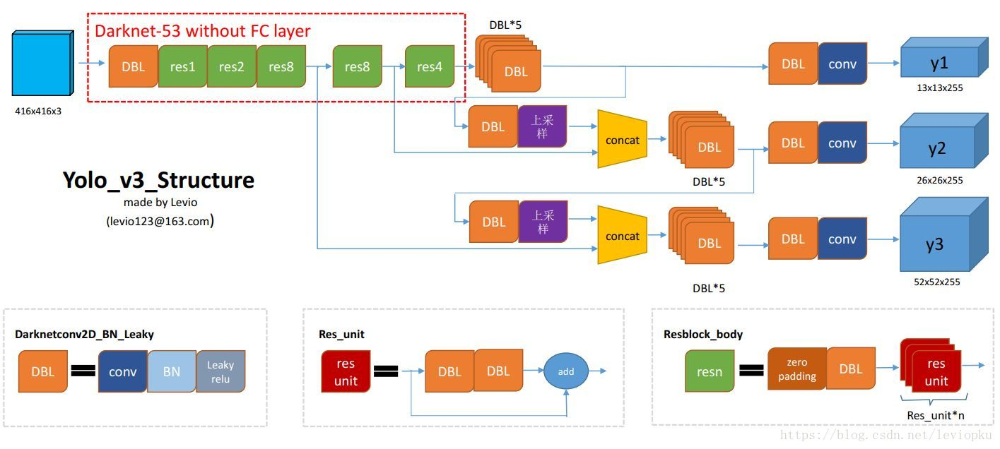

---
categories:
 - YOLO3 源码分析
tags:
 - YOLO3
 - Keras
toc: true
mathjax: true
---


YOLO3 Keras 源码：https://github.com/qqwweee/keras-yolo3


## 网络结构

### 网络结构图



图片来自：https://blog.csdn.net/leviopku/article/details/82660381

将 YOLO3 网络结构划分为多个层和层包，下面的各个层包的解释：

- conv：卷积层
- DBL： Darknetconv2d_BN_Leaky，conv  + BN + Leaky relu。

+ res\*：resblock_body， \* 是数字，表示内含res_unit数目，有res1，res2, … ,res8等等
+ res_unit ： 借鉴残差网络思想，将特征值 $\pmb x$ 与经过两个 DBL 的净输入值 $\pmb z$ 相加作为最终净输入。

操作：

+ concat：张量拼接，即`tf.concat`，会使最后一个维度变长。

<!-- more -->

### Darknetconv2d_BN_Leaky

**什么是 Darknetconv2d_BN_Leaky **

Darknetconv2d_BN_Leaky  是指在卷积层后接一个 BN 然后再通过 relu 函数，这个不是在 YOLO3 提出的，在 YOLO2 就采取在每个卷积层后进行 BN 的做法了。

YOLO3 keras 源码中的 Darknetconv2d_BN_Leaky 的特征图尺寸，要么等于原图尺寸，要么原图的 1/4 主要看 `strides` 参数怎么设定。

**为什么使用 Darknetconv2d_BN_Leaky**

接 BN 主要是为了解决梯度消失问题，同时因为 BN 可以把特诊图拉回均值为 0 ，方差为 1 的分布，所以也能对解决内部协变量位移问题起一定作用，保证对于深层网络而言，每批数据的分布大致相同。（当然均值和方差相同也不一定就是分布相同，所以作用有限）

从 YOLO1 其就在使用 Leaky relu 作为激活函数，Leaky relu 对比 relu 的好处就是，总是有梯度存在的，不至于让深层神经元在训练过程中因为梯度始终为 0 而出现不更新的情况。

**如何实现 Darknetconv2d_BN_Leaky**

在 `\yolo3\model.py` 文件中：

```python
@wraps(Conv2D)
def DarknetConv2D(*args, **kwargs):
    """Wrapper to set Darknet parameters for Convolution2D."""
    darknet_conv_kwargs = {'kernel_regularizer': l2(5e-4)} #l2 是keras的l2正则化器
    darknet_conv_kwargs['padding'] = 'valid' if kwargs.get('strides')==(2,2) else 'same'
    darknet_conv_kwargs.update(kwargs)
    return Conv2D(*args, **darknet_conv_kwargs)

def DarknetConv2D_BN_Leaky(*args, **kwargs):
    """Darknet Convolution2D followed by BatchNormalization and LeakyReLU."""
    no_bias_kwargs = {'use_bias': False}
    no_bias_kwargs.update(kwargs)
    return compose(
        DarknetConv2D(*args, **no_bias_kwargs),
        BatchNormalization(),
        LeakyReLU(alpha=0.1))

```

#### 源码分析：

#####  `l2(5e-4)` :

```python
tf.keras.regularizers.l2(
    l=0.01
)
```

参数:

+ **`l`**: 浮点型，L2 正则项前的系数

`l2(5e-4)` 表示使用 L2 正则项，系数为 `5e-4`

##### `Conv2D(*args, **darknet_conv_kwargs)` : 

```python
tf.keras.layers.Conv2D(
    filters, kernel_size, strides=(1, 1), padding='valid', data_format=None,
    dilation_rate=(1, 1), activation=None, use_bias=True,
    kernel_initializer='glorot_uniform', bias_initializer='zeros',
    kernel_regularizer=None, bias_regularizer=None, activity_regularizer=None,
    kernel_constraint=None, bias_constraint=None, **kwargs
)
```

卷积层

**参数**

+ **`filters`**: 整数，卷积核数目，这个参数决定输出的特征图的深度。
+ **`kernel_size`**: 整数，或者整数列表，卷积核大小
+ **`strides`**: 由两个整数组成的整数或元组/列表，指定卷积沿高度和宽度的步幅。可以是单个整数，以指定所有空间维度的相同值。
+ **`padding`**: `"valid"` 或 `"same"` (不区分大小写).两个值代表窄卷积和等宽卷积
+ **`data_format`**: 一个字符串,  `channels_last` (默认) 或者 `channels_first` 其中之一. 代表输入的张量中通道在哪个维度 `channels_last` 相当于输入的张量形如 `(batch, height, width, channels)` 而`channels_first` 相当于输入张量形如 `(batch, channels, height, width)`. 
+ **`dilation_rate`**: 一个由2个整数组成的整数或元组/列表，指定用于扩张卷积（即空洞卷积）的扩张率。可以是单个整数，以指定所有空间维度的相同值。
+ **`activation`**: 指定激活函数，默认不指定
+ **`use_bias`**: 布尔型，是否使用偏置向量
+ **`kernel_initializer`**: 权重矩阵初始化器
+ **`bias_initializer`**: 偏置向量初始化器
+ **`kernel_regularizer`**: 权重矩阵正则化器
+ **`bias_regularizer`**: 偏置向量正则化器
+ **`activity_regularizer`**: 激活函数初始化器
+ **`kernel_constraint`**: 优化器更新权重后，用于权重的约束函数，要求函数接受一个张量且输出相同形状的张量。
+ **`bias_constraint`**: 优化器更新偏置后，用于偏置向量的约束函数，要求函数接受一个张量且输出相同形状的张量。

`Conv2D(*args, **darknet_conv_kwargs)` : 对 `args` 和 `darknet_conv_kwargs` 解包传参，即除了初始化器，参数都从外部传入。

#####  `DarknetConv2D_BN_Leaky(*args, **kwargs)` :

DBL 块，这个函数主要返回一个函数，该函数通过 compose 构造：

```python
compose(
        DarknetConv2D(*args, **no_bias_kwargs),
        BatchNormalization(),
        LeakyReLU(alpha=0.1))
```

`compose` 是定义在 `\yolo3\utils.py` 的函数

```python
def compose(*funcs):
    """Compose arbitrarily many functions, evaluated left to right.

    Reference: https://mathieularose.com/function-composition-in-python/
    """
    # return lambda x: reduce(lambda v, f: f(v), funcs, x)
    if funcs:
        return reduce(lambda f, g: lambda *a, **kw: g(f(*a, **kw)), funcs)
    else:
        raise ValueError('Composition of empty sequence not supported.')
```

其作用主要是通过`functools.reduce()` 实现可调用对象的连续调用

`DarknetConv2D_BN_Leaky(*args, **kwargs)` 实际上返回的是

```
LeakyReLU(alpha=0.1))(BatchNormalization()(DarknetConv2D(*args, **no_bias_kwargs)(Inputs)))
```

即输入张量经过 `DarknetConv2D` 后接 `BatchNormalization` 接 `LeakyReLU` 。

其中，`BatchNormalization` 和 `LeakyReLU` 分别：

```python
tf.keras.layers.BatchNormalization(
    axis=-1, momentum=0.99, epsilon=0.001, center=True, scale=True,
    beta_initializer='zeros', gamma_initializer='ones',
    moving_mean_initializer='zeros', moving_variance_initializer='ones',
    beta_regularizer=None, gamma_regularizer=None, beta_constraint=None,
    gamma_constraint=None, renorm=False, renorm_clipping=None, renorm_momentum=0.99,
    fused=None, trainable=True, virtual_batch_size=None, adjustment=None, name=None,
    **kwargs
)
```

部分参数：

+ **`axis`**: 整数，应该被标准化的轴数（第几个维度） 经过卷积的数据应该是通道维度被标准化，所以在`data_format="channels_first"` 的 `Conv2D` 后 , 设置 `axis=1` 。
+ **`momentum`**: 移动均值和移动方差的动量。
+ **`epsilon`**: 增加到方差的小的浮点数，以避免除以零。
+ **`center`**:如果为 True，把 `beta` 的偏移量加到标准化的张量上。 如果为 False， `beta` 被忽略。
+ **`scale`**: 如果为 True，乘以 `gamma`。 如果为 False，`gamma` 不使用。 当下一层为线性层（或者例如 `nn.relu`）， 这可以被禁用，因为缩放将由下一层完成。

```python
tf.keras.layers.LeakyReLU(
    alpha=0.3, **kwargs
)
```

该函数被解释为`f(x) = alpha * x for x < 0`, `f(x) = x for x >= 0`.

### resblock_body

**什么是 resblock_body**

一个 resblock_body 包含多个 res_unit，res 是  (Residual Network， ResNet ) 的缩写 , 每个 res_unit 被定义为
$$
Res(\pmb Z)= \pmb Z + DBL(DBL(\pmb Z))
$$
其中的 DBL 都是不改变尺寸的，所以 $+$ 即按元素相加

**为什么使用 resblock_body**

> 根据通用近似定理，一个由神经网络构成的非线性单元有足够的能力来近似逼
> 近原始目标函数或残差函数，但实际中后者更容易学习 [He等人，2016]。
>
> 参考论文：
>
> He K, Zhang X, Ren S, et al. Deep residual learning for image recognition[C] //Proceedings of the IEEE conference on computer vision and pattern recognition. 2016: 770-778.  

容易学习主要体现在

一方面，$h(z)=z+f(z)$ 在求 $z$ 的偏导时，有链式法则得 ：
$$
\frac{\partial E}{\partial w} = \cdots \frac{\partial h}{\partial z}\cdot \frac{\partial z}{\partial w} \cdots \\=\cdots (1+\frac{\partial f}{\partial z})\cdot \frac{\partial z}{\partial w} \cdots
$$


相较于普通深度神经网络的梯度相乘，加入常数项 1 一定程度上能稳定梯度，使它不容易消失。让深层神经网络成为可能。

其次，残差网络可以将前基层的特征隔层传递给下面的层，让一些可能被忽视的特征有了再被提取的可能。

**怎么实现 resblock_body**

在 `\yolo3\model.py` 文件中：

```python
def resblock_body(x, num_filters, num_blocks):
    '''A series of resblocks starting with a downsampling Convolution2D'''
    # Darknet uses left and top padding instead of 'same' mode
    x = ZeroPadding2D(((1,0),(1,0)))(x)
    x = DarknetConv2D_BN_Leaky(num_filters, (3,3), strides=(2,2))(x)
    for i in range(num_blocks):
        y = compose(
                DarknetConv2D_BN_Leaky(num_filters//2, (1,1)),
                DarknetConv2D_BN_Leaky(num_filters, (3,3)))(x)
        x = Add()([x,y])
    return x
```

#### 源码分析

##### `resblock_body(x, num_filters, num_blocks)`

`x` 是输入张量，`num_filters` 是 DBL 卷积核数目，决定了最终输出的通道数目，`num_blocks` 指 res_unit 数目。

可以看到特征图经过一个 resblock_body 先要提取特征并缩小尺寸，随后开始经历 `num_blocks`  个残差单元，每个残差单元的 y 都要经过一个 1\*1 卷积和 3\*3 卷积

##### `ZeroPadding2D(((1,0),(1,0)))(x)`

```python
tf.keras.layers.ZeroPadding2D(
    padding=(1, 1), data_format=None, **kwargs
)
```

2D 输入的零填充层（例如图像）。

该图层可以在图像张量的顶部、底部、左侧和右侧添加零表示的行和列。

**参数**

+ **`padding`**

    : 整数，或 2 个整数的元组，或 2 个整数的 2 个元组。

    + 如果为整数：将对宽度和高度运用相同的对称填充。
    + 如果为 2 个整数的元组：
    + 如果为整数：: 解释为高度和高度的 2 个不同的对称裁剪值：    `(symmetric_height_pad, symmetric_width_pad)`。
    + 如果为 2 个整数的 2 个元组：    解释为 `((top_pad, bottom_pad), (left_pad, right_pad))`。

+ **`data_format`**: 字符串， `channels_last` (默认) 或 `channels_first` 之一， 表示输入中维度的顺序。`channels_last` 对应输入尺寸为  `(batch, height, width, channels)`， `channels_first` 对应输入尺寸为  `(batch, channels, height, width)`。

**输入尺寸**

+ 如果 `data_format` 为 `"channels_last"`， 输入 4D 张量，尺寸为  `(batch, rows, cols, channels)`。

+ 如果 `data_format` 为 `"channels_first"`， 输入 4D 张量，尺寸为  `(batch, channels, rows, cols)`。

**输出尺寸**

+ 如果 `data_format` 为 `"channels_last"`， 输出 4D 张量，尺寸为  `(batch, padded_rows, padded_cols, channels)`。
+ 如果 `data_format` 为 `"channels_first"`， 输出 4D 张量，尺寸为  `(batch, channels, padded_rows, padded_cols)`。

`ZeroPadding2D(((1,0),(1,0)))(x)` 表示在 x 的上面和左边填充一列 0 

```python
x = ZeroPadding2D(((1,0),(1,0)))(x)
x = DarknetConv2D_BN_Leaky(num_filters, (3,3), strides=(2,2))(x)
```

上边和左边填一列零后，用 3\*3 卷积核，以 2 跨步，`valid` 模式，经过卷积输出的张量尺寸为（(h-3+1)/2向下取整，(w-1+3)/2向下取整），这样也起到了池化层的作用。

##### `Add()([x,y])`

```python
tf.keras.layers.Add(
    **kwargs
)
```

该实例没有舒适化参数，直接实例化调用就行，调用时的输入参数是一个张量列表，要求列表内的张量必须形状相同，最后结果是对应元素相加。

`Add()([x,y])` 是 y 是经过两个 DBL 的特征图

### darknet_body

**什么是 darknet_body**

darknet_body 就是 YOLO3 的支柱网络，它是 “Darknet-53 ”去掉最后一层卷积层，Darknet-53 结构图如下：


**为什么使用 darknet_body**

因为 Darknet-53 比 Darknet-19 牛逼，Darknet-53 也是改良自 Darknet-19 ，主要改良是引入了残差结构和用卷积层代替池化层。

引入残差结构可能为了能提高网络深度。

使用卷积代替池化，可能是因为单纯的池化没有可学习参数，一般都是在池化前加上 1\*1 卷积增加池化层的特征提取功能，Darknet-53 把 1\*1 卷积与池化层合并成一个卷积了，减少了一层运算。

**怎么实现 darknet_body**

在 `\yolo3\model.py` 文件中：

```python
def darknet_body(x):
    '''Darknent body having 52 Convolution2D layers'''
    x = DarknetConv2D_BN_Leaky(32, (3,3))(x)
    x = resblock_body(x, 64, 1)
    x = resblock_body(x, 128, 2)
    x = resblock_body(x, 256, 8)
    x = resblock_body(x, 512, 8)
    x = resblock_body(x, 1024, 4)
    return x
```

相关层的源码上面已经解释过了，这里就照着结构图复现就完事了。

### yolo_body

**什么是 yolo_body**

yolo_body 从 yolo3 的支柱网络 Darknet-52 手里接过输出的特征图，兵分三路，最终生成了 y1，y2，y3 三个输出，三个输出深度一直，唯一不同就是尺寸，前面的 Darknet-52 是特征提取，到这就开始根据前面提取的特征进行目标识别了。

**为什么要分成三个输出，每个输出还要拼接前面的层**

因为自从 YOLO2 开始，YOLO 网络开始借助 RPN 的思想，最终输出的特征图的每一个像素点，其实包含了一个**感受野区域**的特征信息，显然 13\*13 的特征图，意味着感受野比较大，这样的特征图适合识别大物体；相反 52\*52 的感受野较小，这样的特征图适合识别小物体，这也是相对于YOLO2 的改进，这样 YOLO3 就既能识别大物体，又能识别小物体了。

拼接之前层的输出，是从 YOLO2 就开始有的思想，叫细粒度分类，也是为了能保留小物体的特征。

**怎么实现 yolo_body**

在 `\yolo3\model.py` 文件中：

```python
def make_last_layers(x, num_filters, out_filters):
    '''6 Conv2D_BN_Leaky layers followed by a Conv2D_linear layer'''
    x = compose(
            DarknetConv2D_BN_Leaky(num_filters, (1,1)),
            DarknetConv2D_BN_Leaky(num_filters*2, (3,3)),
            DarknetConv2D_BN_Leaky(num_filters, (1,1)),
            DarknetConv2D_BN_Leaky(num_filters*2, (3,3)),
            DarknetConv2D_BN_Leaky(num_filters, (1,1)))(x)
    y = compose(
            DarknetConv2D_BN_Leaky(num_filters*2, (3,3)),
            DarknetConv2D(out_filters, (1,1)))(x)
    return x, y


def yolo_body(inputs, num_anchors, num_classes):
    """Create YOLO_V3 model CNN body in Keras."""
    darknet = Model(inputs, darknet_body(inputs))
    x, y1 = make_last_layers(darknet.output, 512, num_anchors*(num_classes+5))

    x = compose(
            DarknetConv2D_BN_Leaky(256, (1,1)),
            UpSampling2D(2))(x)
    x = Concatenate()([x,darknet.layers[152].output])
    x, y2 = make_last_layers(x, 256, num_anchors*(num_classes+5))

    x = compose(
            DarknetConv2D_BN_Leaky(128, (1,1)),
            UpSampling2D(2))(x)
    x = Concatenate()([x,darknet.layers[92].output])
    x, y3 = make_last_layers(x, 128, num_anchors*(num_classes+5))

    return Model(inputs, [y1,y2,y3])
```

这里 darknet 和 yolo3 都是用的 keras 的 Functional API 构建的网络模型，Functional API 挺简单的而且还支持多输出。

#### 源码讲解

##### `make_last_layers(darknet.output, 512, num_anchors*(num_classes+5))`

这个函数先把 yolo3 的输出分成两个：y1 和不是 y1，源码结构清晰，一目了然，其中参数`arknet.output` 是提取前面已经封装成模型的 `darknet` 的输出，把前一个模型的输出作为这个模型的输入， 以前后顺序衔接两个模型。`512` 是中间 DBL 的卷积和数目，`num_anchors*(num_classes+5)` 是最终生成的特征图的深度，5 是指 4 个坐标信息 + 置信度。

##### `yolo_body(inputs, num_anchors, num_classes)`

构建 YOLO3 网络，通过 `UpSampling2D(2))(x)` 、 `darknet.layers[]`  、和 `Concatenate()` 实现特征图拼接 darknet 中间某层的输出的操作。

##### `UpSampling2D(2))(x)`

```python
tf.keras.layers.UpSampling2D(
    size=(2, 2), data_format=None, interpolation='nearest', **kwargs
)
```

2D 输入的上采样层。

沿着数据的行和列分别重复 `size[0]` 和 `size[1]` 次。

**参数**

+ **size**: 整数，或 2 个整数的元组。 行和列的上采样因子。
+ **data_format**: 字符串， `channels_last` (默认) 或 `channels_first` 之一， 表示输入中维度的顺序。`channels_last` 对应输入尺寸为  `(batch, height, width, channels)`， `channels_first` 对应输入尺寸为  `(batch, channels, height, width)`。
+ **interpolation**: 字符串，`nearest` 或 `bilinear` 之一。  

**输入尺寸**

+ 如果 `data_format` 为 `"channels_last"`， 输入 4D 张量，尺寸为  `(batch, rows, cols, channels)`。
+ 如果 `data_format` 为 `"channels_first"`， 输入 4D 张量，尺寸为  `(batch, channels, rows, cols)`。

**输出尺寸**

+ 如果 `data_format` 为 `"channels_last"`， 输出 4D 张量，尺寸为  `(batch, upsampled_rows, upsampled_cols, channels)`。
+ 如果 `data_format` 为 `"channels_first"`， 输出 4D 张量，尺寸为  `(batch, channels, upsampled_rows, upsampled_cols)`。

上采用就是下采样的逆操作，这里是每个元素重复4次变成一个 4\*4 区域，使整个特征图尺寸扩大 4 倍（高扩 2 倍，宽扩 2 倍）

##### `darknet.layers[]`

`layers` 是 `tf.keras.Model` 类的属性，可以通过 `[]` 提取特定的层，也可以用`Model.get_layer()` 方法替代。

##### `x = Concatenate()([x,darknet.layers[152].output])`

```python
tf.keras.layers.Concatenate(
    axis=-1, **kwargs
)
```

连接一个输入张量的列表。

它接受一个张量的列表， 除了连接轴之外，其他的尺寸都必须相同， 然后返回一个由所有输入张量连接起来的输出张量。

**参数**

+ **axis**: 连接的轴。
+ ***\*kwargs**: 层关键字参数。

**输入**

+ 张量列表，要求除了连接轴之外，其他的尺寸都必须相同

注意区分于 `Add()` 一个是对应元素相加，一个把一个轴上的数据前后连接在一起。

## Tiny YOLO 的网络结构

通过对前面逐层代码的学习，Tiny YOLO 的结构一目了然，Tiny YOLO 缩减了 Darknet-52，并且只输出 y1 和 y2，它有更快的收敛速度，但是相对的精度没有 YOLO 高，它的源码在 `\yolo3\model.py` 文件中：

```python
def tiny_yolo_body(inputs, num_anchors, num_classes):
    '''Create Tiny YOLO_v3 model CNN body in keras.'''
    x1 = compose(
            DarknetConv2D_BN_Leaky(16, (3,3)),
            MaxPooling2D(pool_size=(2,2), strides=(2,2), padding='same'),
            DarknetConv2D_BN_Leaky(32, (3,3)),
            MaxPooling2D(pool_size=(2,2), strides=(2,2), padding='same'),
            DarknetConv2D_BN_Leaky(64, (3,3)),
            MaxPooling2D(pool_size=(2,2), strides=(2,2), padding='same'),
            DarknetConv2D_BN_Leaky(128, (3,3)),
            MaxPooling2D(pool_size=(2,2), strides=(2,2), padding='same'),
            DarknetConv2D_BN_Leaky(256, (3,3)))(inputs)
    x2 = compose(
            MaxPooling2D(pool_size=(2,2), strides=(2,2), padding='same'),
            DarknetConv2D_BN_Leaky(512, (3,3)),
            MaxPooling2D(pool_size=(2,2), strides=(1,1), padding='same'),
            DarknetConv2D_BN_Leaky(1024, (3,3)),
            DarknetConv2D_BN_Leaky(256, (1,1)))(x1)
    y1 = compose(
            DarknetConv2D_BN_Leaky(512, (3,3)),
            DarknetConv2D(num_anchors*(num_classes+5), (1,1)))(x2)

    x2 = compose(
            DarknetConv2D_BN_Leaky(128, (1,1)),
            UpSampling2D(2))(x2)
    y2 = compose(
            Concatenate(),
            DarknetConv2D_BN_Leaky(256, (3,3)),
            DarknetConv2D(num_anchors*(num_classes+5), (1,1)))([x2,x1])

    return Model(inputs, [y1,y2])
```

