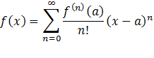
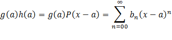
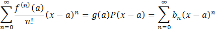
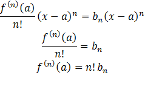
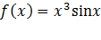
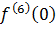
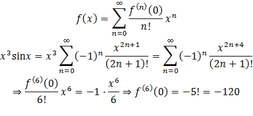
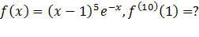
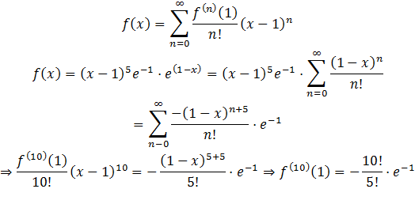

**使用泰勒公式求高阶导数**

写出f(x)泰勒展开的抽象公式

写出部分因式的具体展开，形如：

其中，P(x-a)表示关于x-a的无穷次多项式，g(a)是常数，所以最终结果也是关于(x-a)的无穷次多项式，系数为bn

由于泰勒展开具有唯一性，故下式恒成立

由待定系数法法，可求抽象公式中x-a的n次项前的系数，即

例：

已知

求

解：

当泰勒展开不在0点是，可通过变形，使之变为关于x-a的函数，令其在0 点展开，例如：

解

