## 快速开始

### 使用微信扫描进入记忆仓库

使用微信扫描下方二维码进入记忆仓库


<!--more-->

登录完成后，即可以看到记忆仓库的主页


## 记忆库管理

### 创建记忆库

+ 点击下方导航栏中【记忆库】，进入到记忆库管理页面，点击【加号】


+ 选择【添加记忆库】

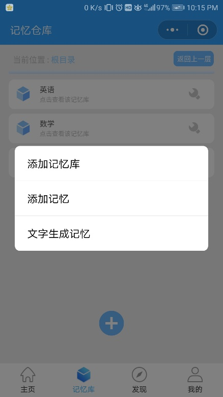

+ 在弹出的菜单中选择【创建新的记忆库】

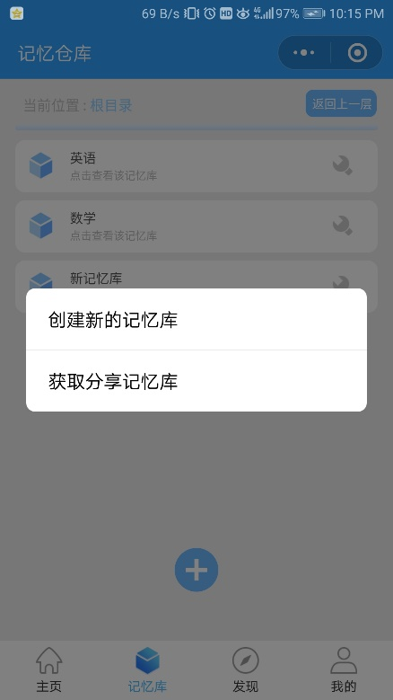

+ 输入记忆库名称，即可完成创建。

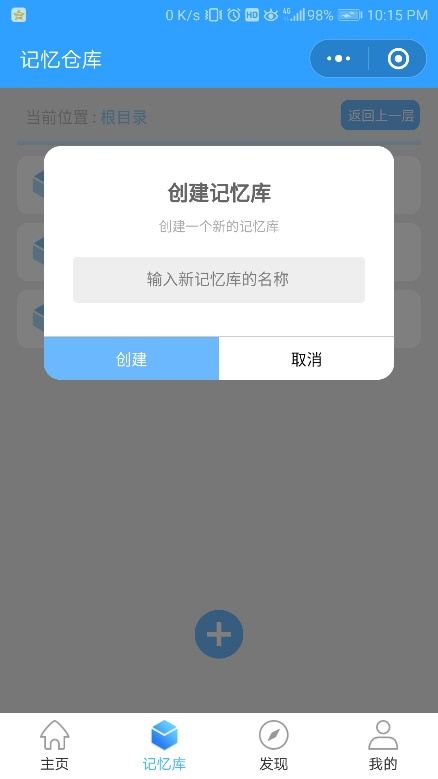

### 修改记忆库名称

用户可以对已经创建完成的记忆库进行修改名称等操作

+ 点击记忆库右侧的【工具按钮呢】


+ 点击【重命名】


+ 输入新记忆库的名称，点击确定即可。

### 删除记忆库

同样，点击记忆库右侧的【工具按钮】，点击【删除】。


## 录入记忆

### 直接添加记忆

+ 用户可以在首页点击【写入记忆】按钮，或者在某一记忆库下点击【加号】，点击【添加记忆】，即进入写入记忆页面

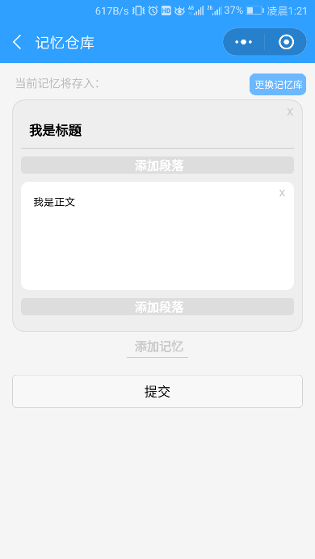

+ 在写入记忆页面，用户点击【添加段落】按钮，可以选择不同样式的段落，支持的段落有【标题】【文字】【图片】【画板】四种。

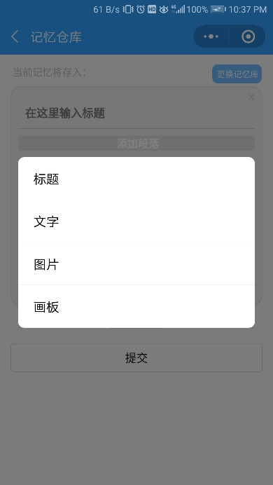

+ 在画板模式中，用户可以将难以录入的公式、图像等信息，画在手机上，下方左右【箭头】可以移动画板视角，使画板容纳更多信息。完成绘画后，点击【添加到记忆】按钮，即可生成段落。


+ 同时，记忆仓库支持将多个记忆同时提交，点击下方【添加记忆】按钮，便可以书写第二个记忆的内容。

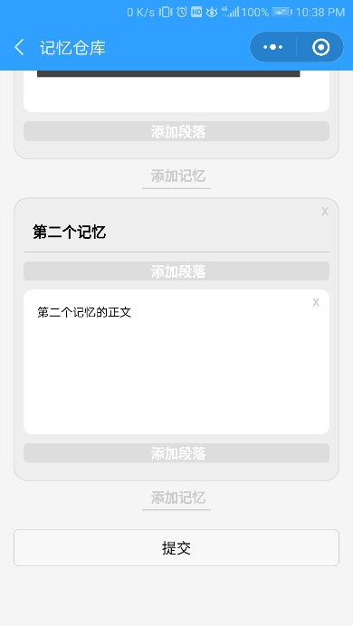

### 文字生成记忆

用户可以在添加记忆的时候，选择【文字生成记忆】模式。

对于一段长文字，用户可以在该模式下，将其转换成指定的格式，然后自动录入的记忆仓库中，这里我们约定：**每个记忆用两个及两个以上的换行隔开，每个记忆中，用一个换行来将标题和内容分割。**

例如：

```
endow…with sth. 
 把某物赋予……


 charge sb. with sth. 
 指控某人某罪


 bear little/no resemblance to… 
 与…没有相似之处
```

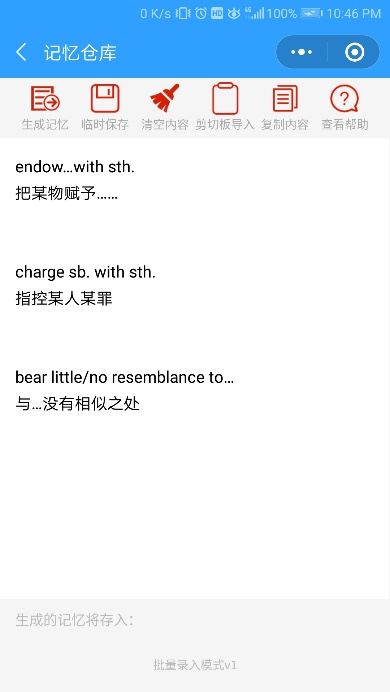

将自动转化为三个记忆。

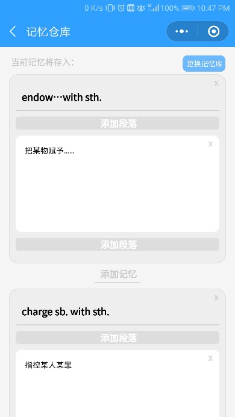

## 回顾记忆

### 回顾记忆

+ 用户点击在首页，点击【开始回顾】


+ 点击【回顾记忆库】，选择需要回顾的记忆库即可。


+ 在记忆仓库回顾的系统中，用户通过标题联想到该记忆的内容，并根据自身实际情况，选择【已掌握】或【未掌握】按钮

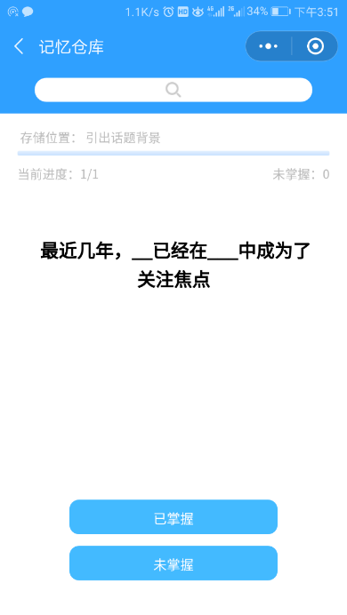

+ 如果点击了【已掌握】后，发现自己掌握的并不准确，可以点击【更多操作按】将该记忆【标记为未掌握】

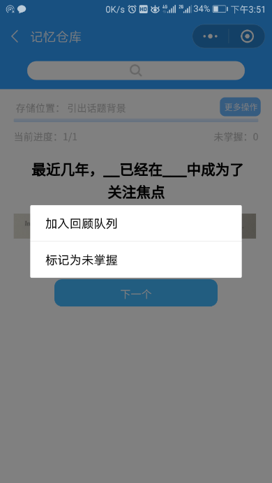

### 浏览概要

+ 点击记忆库右边的【工具】按钮，选择【浏览概要】，即可以进入概要浏览模式

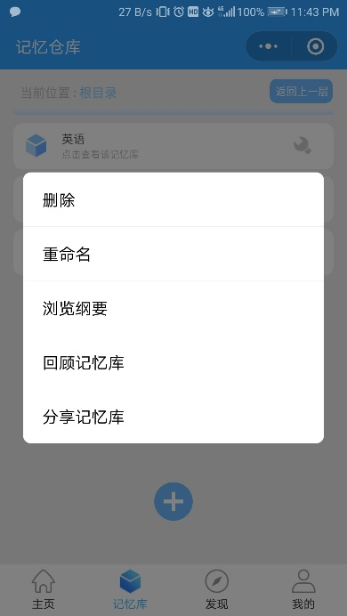

+ 如果记忆库下有子记忆库，点击继续点击【子记忆库名称】可进入子记忆库


+ 在该模式下，只显示记忆的标题，点击【记忆的标题】即可查看该记忆的内容。

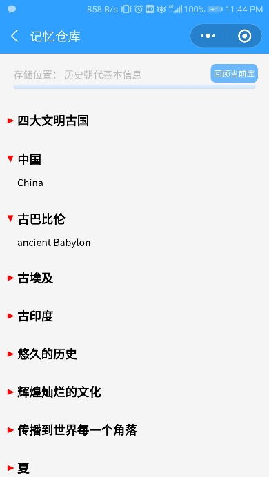

## 分享记忆

### 分享给好友

+ 点击记忆库右边的【工具】按钮

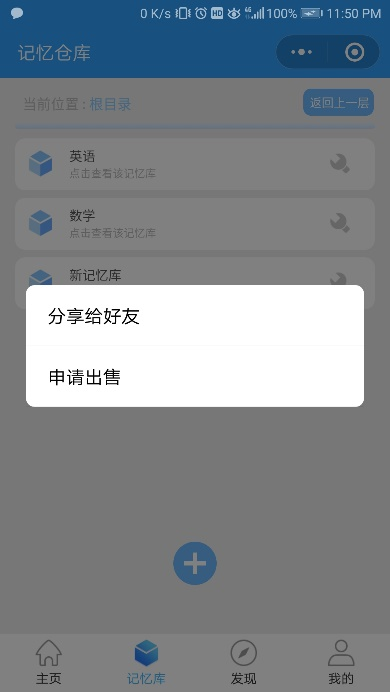

+ 点击【分享记忆库】，分享成功后，系统会为该记忆库生成分享码，然后将该分享码复制给好友即可。


### 获得好友分享的记忆库

+ 好友接受到该分享码后，可以在添加记忆库时，选择【获取分享记忆库】来接受好友的分享。

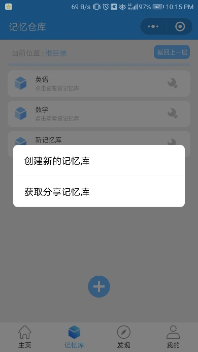

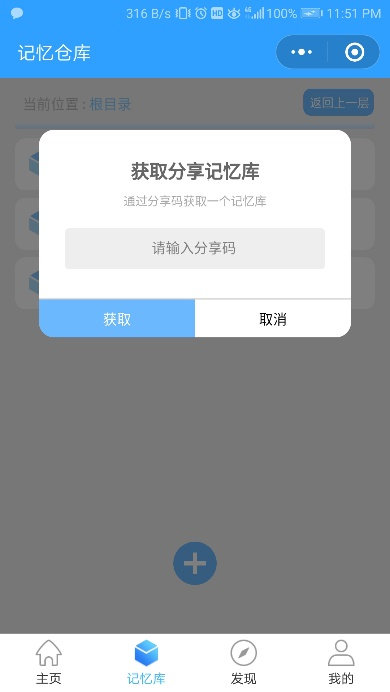

## 回顾队列

### 管理回顾队列

+ 在主页，点击【我的】选项卡，点击【回顾队列】按钮，则可查看回顾队列。


+ 用户可以通过下方【加号】按钮与队列后的【工具】按钮对队列进行增改


### 添加记忆至回顾队列

+ 用户可以在浏览、回顾记忆时，将某一记忆添加到回顾队列，亦可以将某一记忆库直接导入。点击进入一个回顾队列，点击【加号】按钮，选择批量导入即可。

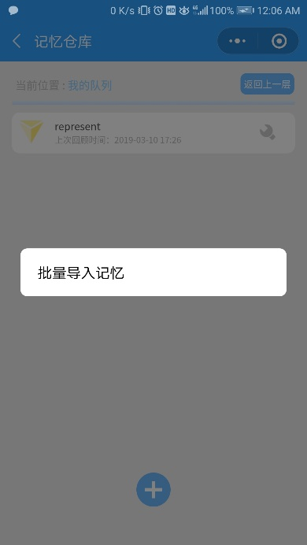

### 复习回顾队列中的记忆

+ 在开始回顾时，选择回顾自定义队列，即可选择某一队列进行回顾。

