## n 次方差公式

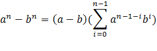

**重要极限补充**

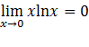

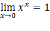

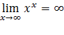

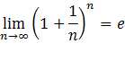

## 等价无穷小

若

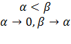

则

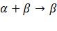

## 完备事件组

刀切全集，不重不漏

## 概率不等式补充

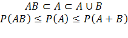

## 互斥

若 AB 互斥，则 A 与 BC 也互斥

所以

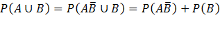

## sin 与 cos 的一些积分

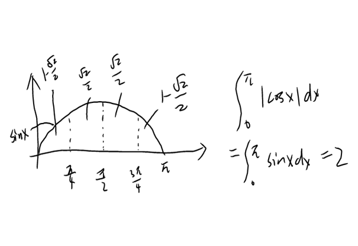

## 参数为离散值的函数

第一类：函数列

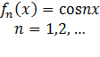

为数列  

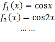

第二类：分段函数

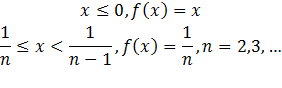

这是合并的写法， n 取一个值，代表一个分段，不可单纯认为函数分为了两段

## 贝叶斯与普通条件概率

二者都是为了求

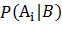

区别在于事件 B 是由什么构成的

贝叶斯

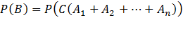

普通条件

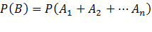

如果事件 B 是事件组中的某个事件，则用普通条件概率计算

如果事件 B 是指事件组的某个事件与另一个事件同时发生，则用贝叶斯计算

## 若未知数趋于正无穷，则函数单调有界必有极限

## 海涅定理

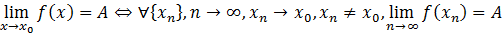

## 积分的放缩

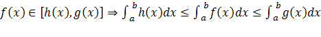

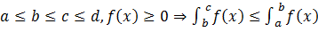

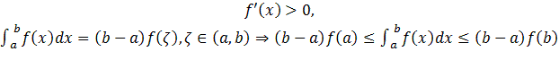

## 牛顿莱布尼兹公式：父子转换

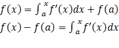