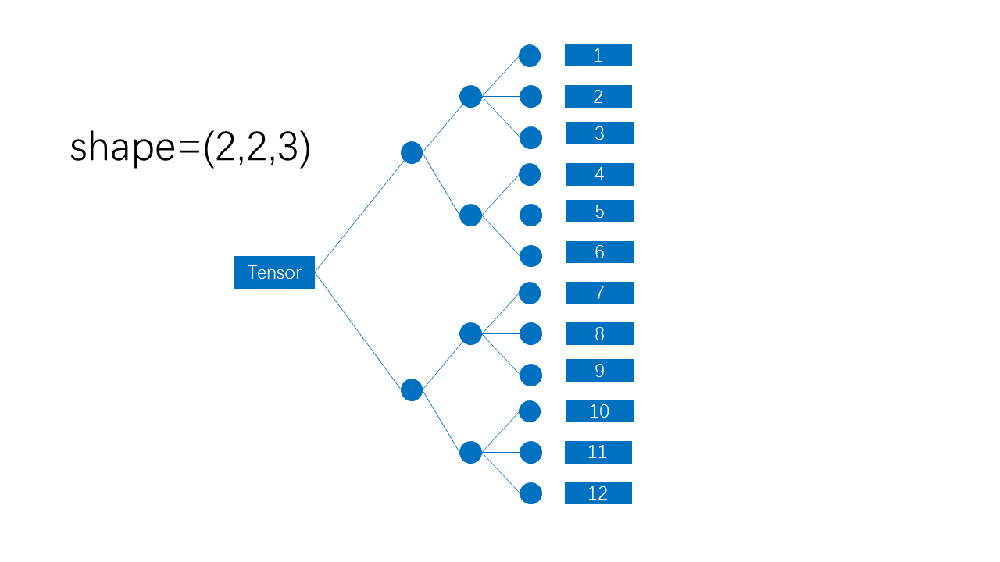
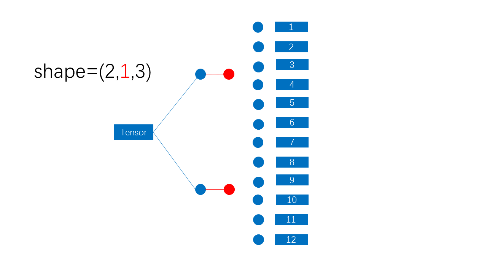
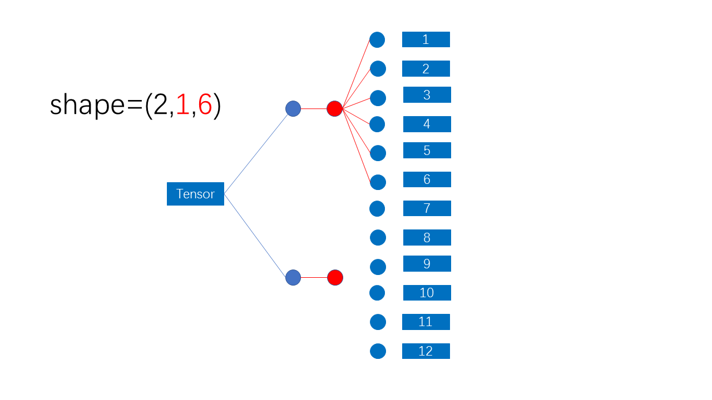
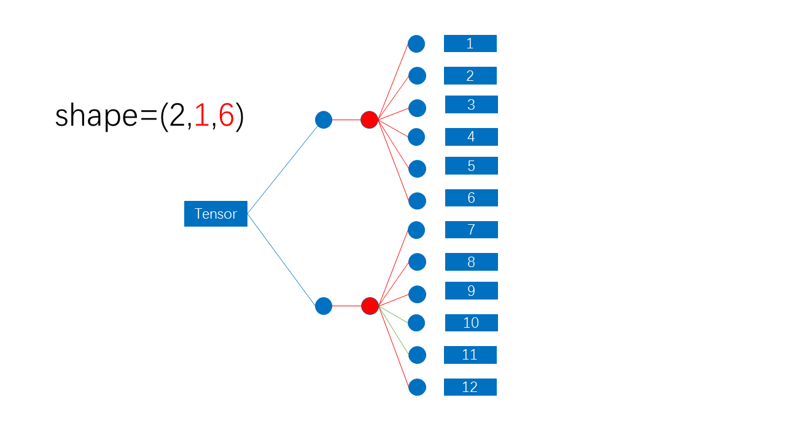
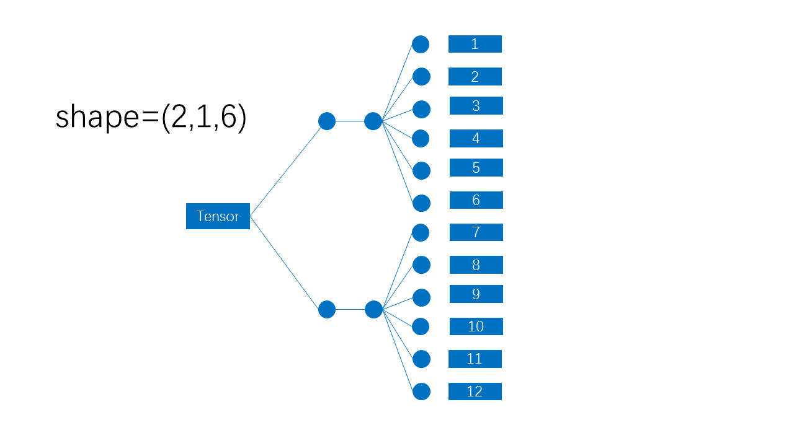
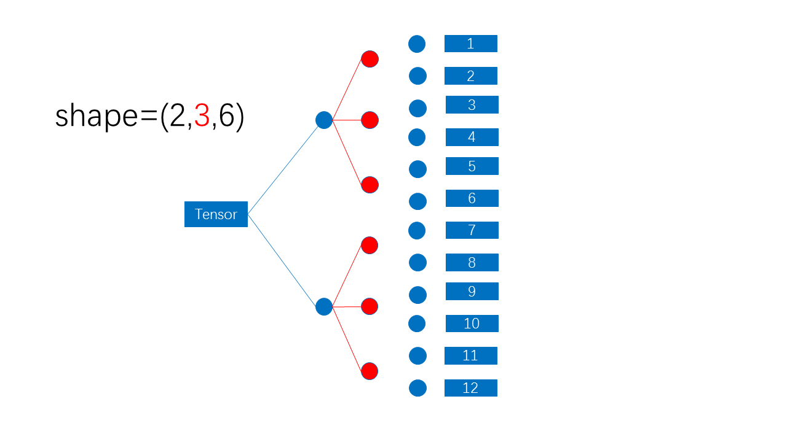
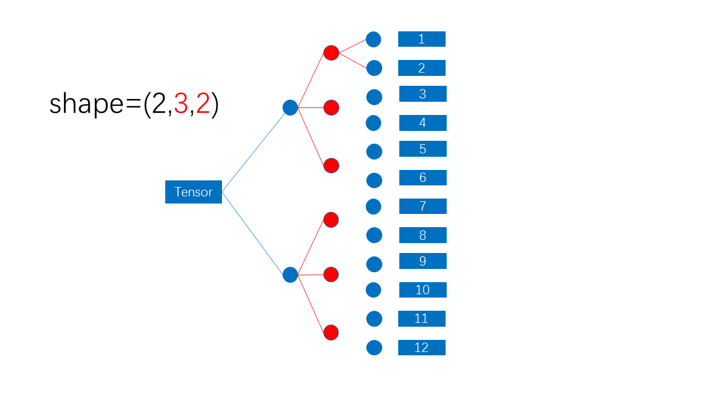

## 前言

在机器学习领域，通常把标量、向量、矩阵，都称为张量，即将张量分为：

+ 0 维张量，标量
+ 1 维张量，向量
+ 2 维张量，矩阵
+ ....
+ n 维张量

标量很好表示，就是一个数：
$$
1
$$
向量是一组数：
$$
(1,2,3)
$$
矩阵是一组向量
$$
((1,2,3),(4,5,6))
$$
同时也可以把矩阵表示成类似表格的形式
$$
\begin{bmatrix} 1 & 2 & 3 \\ 4 & 5 & 6 \end{bmatrix}
$$

3 维张量可以表示为一组矩阵
$$
(((1,2,3),(4,5,6)),((7,8,9),(10,11,12)))
$$
这样看上去不是很直观，但当维度大于 2 以后，也无法用表格直观表示了，这里我推荐使用树状表示法

树状表示法的每一个分支代表一个索引，最后一列的圆圈代表张量中每个分量，其后紧接的方块是分量的数值，例如整数 12 被存储于 `Tensor[1][1][2]` （索引从 0 开始）

几乎所有机器学习框架，都会给张量分配一个名为 `shape` 的属性，该属性直译为形状，表示张量每个维度的“长度”，如上面的这个张量的`shape=(2,2,3)` 每个维度的“长度”决定了最大索引号是多少，如第一维的长度 2 ，则第一维度的最大索引号只能到 1，同时分量个数等于各维度长度之积，如上图张量中的分量数目为 ` 2*2*3=12`

伴随着 `shape` 属性的出现，随之而来的就是 `reshape` 方法，`reshape` 方法可以改变一个张量维度数目和维度长度。

但是张量维度也不是想怎么改变就怎么改变的，不论你是几维张量，在数据结构上，说到底也不过是一个多维数组，多维数组本身就是一个逻辑结构，实际在内存中，它其实是一个元素接一个元素的线性储存的，所以原则上，无论一个张量 `shape` 怎么改变，它的分量个数都是不变的，而且它的分量在内存中的存储顺序也是不变的。

<!--more-->

## 如何直观理解多维张量的 reshape 方法

假设给定一个多维张量，将它表示为下图

这是一张树状图，**`Tensor` 和其后的每一个圆圈都是一个结点**，最后一列的所有结点代表张量中的每一个分量，其后紧跟的方块表示分量中的数值，前三列中每一列对应一个维度，**每一列结点的出度就是该列对应维度的长度**，

**`Tensor` 是根结点，位于第一列**，出度为 2 ；第二列每一个圆圈出度为 2 ；第三列的每一个圆圈出度为 3 ，所以由图可知，该多维张量的 `shape=(2,2,3)`

现在我们假设期望将该张量通过 `reshape` 方法，令其第二维度长度为 1：

首先分析要改变的维度，第一维度没有变化，第二维度变化了，同时也导致第二维度之后其他维度变化了，体现在图像上就是，第一列的出度没有变化，所以第二列的结点位置也不需要变化，此时可以暂时擦去第二列之后的、除最后一列外其他列。

> 为什么不擦去最后一个列呢？因为前面说过，reshape 的原则是不会改变分量数目和内存中储存顺序，最后一列中圆圈数目就是分量数目，最后一列所有圆圈的先后位置关系就是分量在内存中存储的顺序关系，所以无论如何 reshape， 最后一列的图像永远不会改变。

第二个维度长度变为了 1 ，所以第二列的每个结点出度变了 1

画出第二所有结点向后的分支，形成第三列结点

根据 `reshape` 原则可知，分量数目不改变且各维度长度之积等于分量数目，所第三个维度长度一定（必须）等于 6，即第三列每个结点的出度等于 6，把第三列结点按照出度为 6 的标准向最后一列结点连接

画出第三列所有结点向后的分支

此时得到的就是 `shape=(2,1,6)` 的图像。

同理，尝试将 `shape=(2,1,6)` 的张量转化为 `shape=(2,2,3)` 的张量，定义 `shape=(2,1,6)` 的张量如下：

第一个维度没变，所以第一列出度不变，即第二列图像不变，最后一列肯定不会变化，所以这里应该先暂时擦掉第三列的结点

考虑第二个维度的长度变为3，所以第二列每个结点的出度应该为 3 ，画出每个结点向后的分支：

通过计算可知，最后一个维度长度必须为 2 ，那么也就是说，第三列的出度为 2 ，

补全第三列所有向后的分支，得到

大功告成。